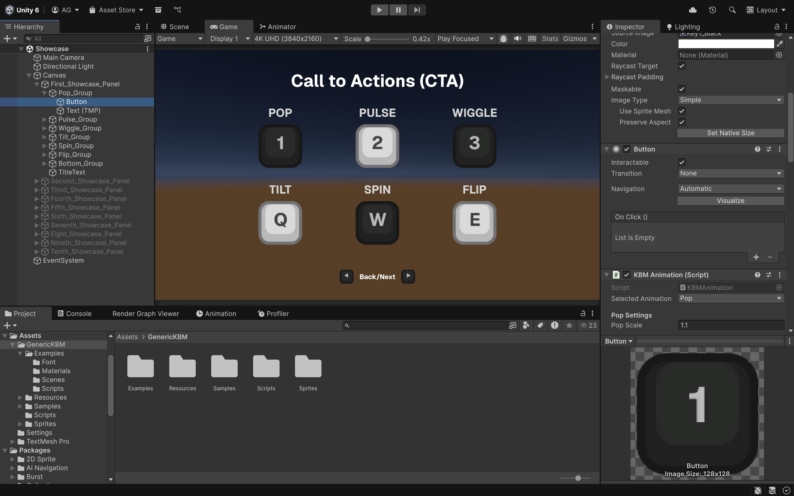
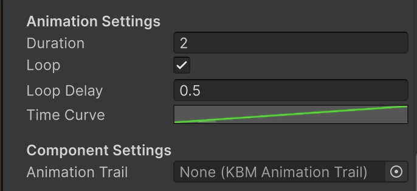
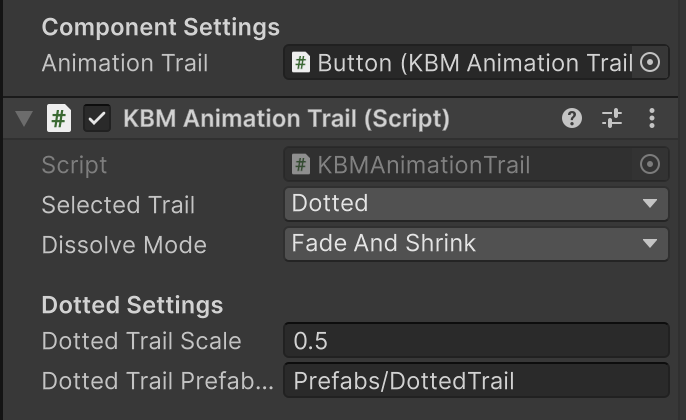



### TL;DR

[Unity Asset Store](https://u3d.as/3DJ2)
[Itch Sprite Only Version](https://abhishta.itch.io/generick-kbm)

This started as a small project to create a few sprites and a simple system for my game *Quality Assurance* to handle sprite animations for CTAs. It grew into a fully modular animation library for Unity.  

The library is lightweight and fast, packed with 13+ base animations (Pulse, Slide, Node, Fade, etc.). All animations are modular and can be combined to create more complex effects. You can also script your own animations and run them through the library for easy management.

---

### Introduction

Recently, I started working on a First-Person Psychological Horror game in Unity. It required a system to handle keyboard and mouse inputs for object interactions. Some of these inputs needed players’ attention, along with CTA (Call-to-Action) animations and visual guidance for complex actions (e.g., shaking the mouse, moving it left/right, or in any chosen direction).  

Instead of building only the bare minimum, I created a sprite animation library aimed at helping solo developers avoid reinventing the wheel. Many existing systems are feature-rich but bloated and expensive, often offering more than what’s really needed.  

I designed this library to be modular: animations can harmonize, overlap, or even cancel each other. This flexibility makes it easier to visually communicate with players.

---

### Development

I began by researching UI animation approaches. The key questions were:  
- What are the trade-offs between scripted animations and Unity’s Animator?  
- How should the animations be packaged?  
- How can level designers use this system without friction?  

Answering these questions was crucial before building something useful for others, not just myself.  

---

#### Performance Trade-Offs

Performance is critical for UI. Animations should have minimal overhead. In Unity, you can animate using either:  
1. **Scripts** (update `Transform`, `CanvasGroup`, or other components programmatically using math like interpolation and wave functions).  
2. **Animators** (keyframes and animation clips).  

Unity’s Animator is ideal for non-technical designers—it’s intuitive and quick for creating simple to complex animations. But after researching, I found scripted animations to be better for performance and flexibility.  

Here’s a quick comparison:

| Option | Pros | Cons | Best Use Case |
|:-----------|:------------|:------------|:------------|
| **Script** | Lightweight, no allocations, customizable, parameterized, tweakable at runtime | Harder to manage for complex animations, more code to maintain | Small/simple animations (shakes, pulses, color changes), performance-critical scenarios |
| **Animator** | Visual editor, easy for artists, reusable clips, good for complex sequences | More overhead, harder to parameterize runtime behavior, asset-heavy | Multi-step animations, artist-driven workflows, complex UI sequences |
| **Tween Libraries (DOTween, LeanTween, etc.)** | Concise code, easing, sequences, callbacks, supports runtime param changes | Small allocations, external dependency, slight performance cost | Prototyping, quick setup, readable code, convenience over micro-optimization |

I opted for a **scripted approach** as the default, with an optional hybrid system that lets you plug in your own Animation Clips if needed. This provides modularity while keeping performance tight.

---

#### Packaging the Animation

Using scripts, I built a set of common animations (Pop, Pulse, Wiggle, etc.) frequently used for CTAs and highlights. One component, `KBMAnimation`, exposes all built-in animations, letting users select, configure, and tweak parameters easily.  



Each animation shares common properties:  
- Duration  
- Looping behavior  
- Delay between loops  
- Timing (linear vs curve-based)  

These are exposed in a simple, intuitive way for designers.  



For extra visual flair, I added particle trails to emphasize motion. Unity’s built-in Trail Renderer wasn’t suited for UI (it’s designed for World Space), so I implemented a custom lightweight Trail system using object pooling to spawn sprites for ghost or dotted trail effects.  

Since multiple `KBMAnimation` components can run on the same object, I also added a way to define relationships between the base animation and its trail.  



This modular structure, combined with customizable curves, creates an elegant foundation for building and extending animations. Power users can easily add their own effects or adapt the system for new use cases.  

```c# {lineNos=true}
void SomeAnimation()
{
  if (elapsedTime < duration)
  {
    // Interpolate over Time, evaluated with the Time Animation Curve
    float t = elapsedTime / duration;
    InterpolateAndApply(x, y, timeCurve.Evaluate(t));
    
    // Spawn Trail (if set)
    if (animationTrail != null) animationTrail.SpawnTrail();
    
    // Update elapsed time
    elapsedTime += Time.deltaTime;
  }
  else
  {
    // Reset state
    SomeResetFunction();

    // Try looping
    TryLoop();
  }
}
```

### Building Designer Experience

The usability of this library is key to its success. Designer/Developer Experience (DX) was a top priority, so I created Editor utilities to minimize documentation overhead.

1. Sample Scene: Includes common use cases. Designers can copy prefabs directly into their game scenes for instant plug-and-play.

2. Responsive Editor UI: Since the component is heavily parameterized, unused options are hidden based on the selected animation. This keeps the interface clean and intuitive.

3. Tooling and Docs: Tooltips, warnings, and inline documentation help designers understand behavior quickly. Full documentation is also included for deeper learning.

### Overall

The system, GenericKBM, is scheduled for release in mid-September on the Unity Asset Store and Itch. There will be multiple options available—ranging from just the sprite set to the full animation library package.