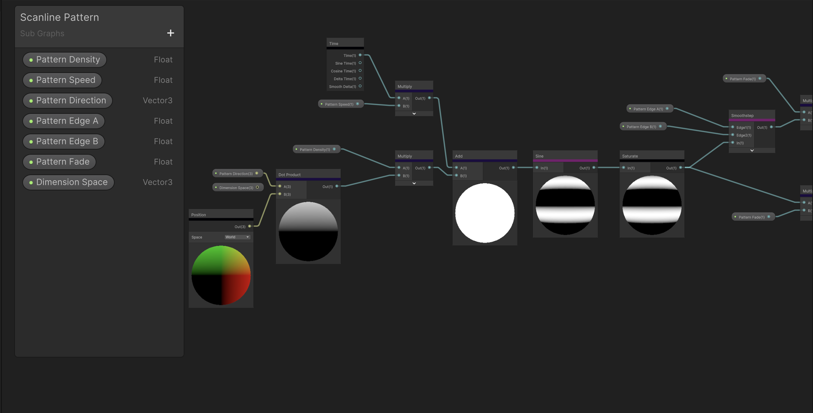
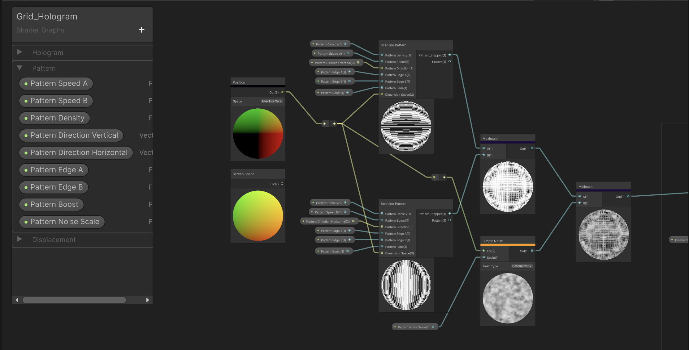
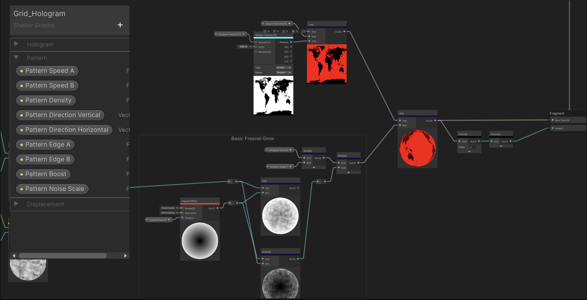
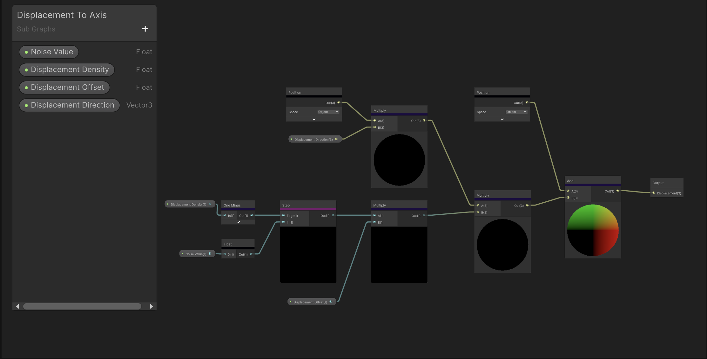
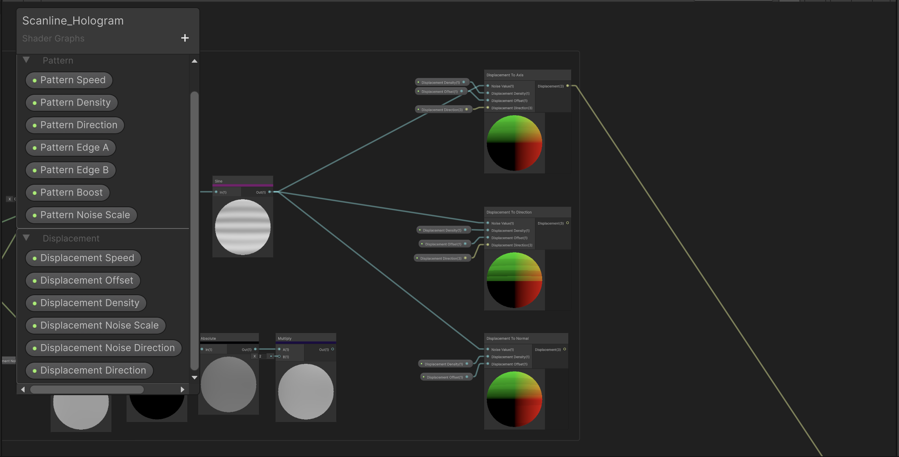
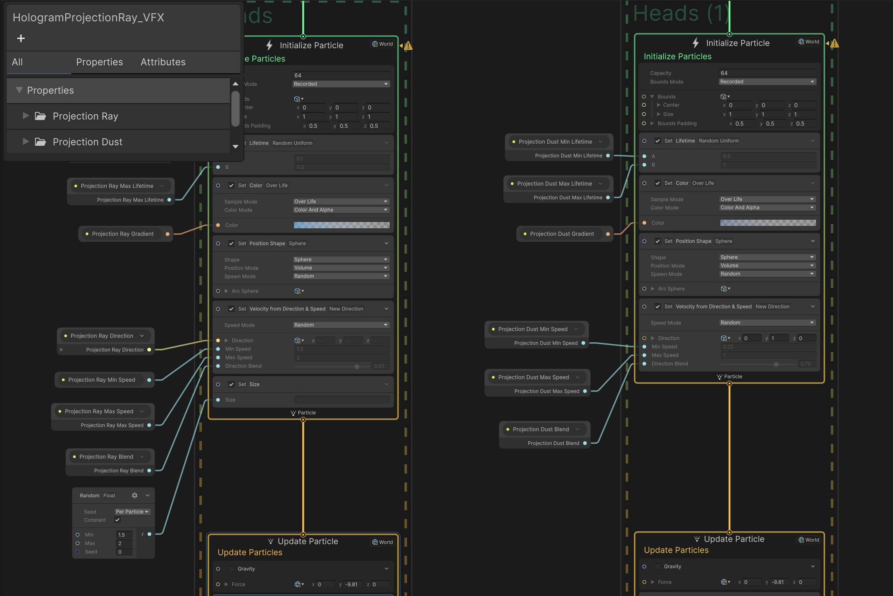
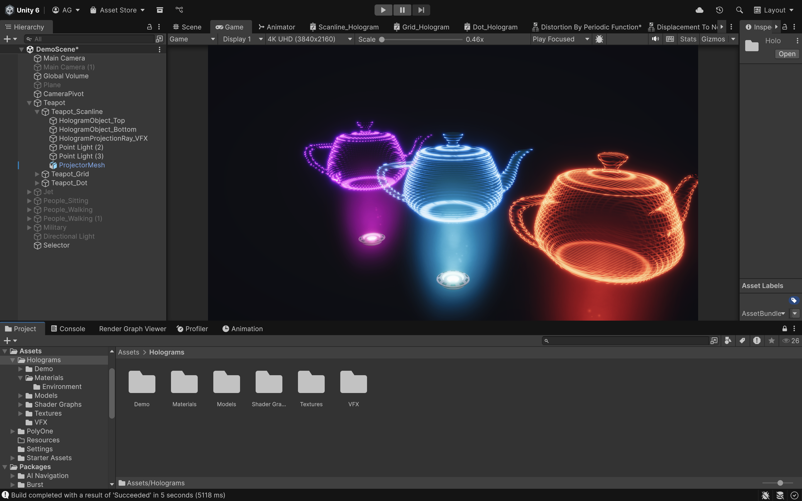



### TL;DR

Experimenting to create a Hologram VFX using Shader Graph & VFX Graph that works for any model and making it as modular as possible. More in my ArtStation.

[ArtStation](https://www.artstation.com/artwork/XJL4ml)

---

### Introduction

Wanting to introduce my skillset in Tech Art to showcase my proficiency in Shader Graph and VFX Graphs in Unity, I made a simple Hologram VFX that is easy to use for any model and try to make it as modular as possible for the designers. I started to breakdown some key components of this effect to make it as "realistic" as possible in Unity 6 URP. The key components for this effect I've broke down into three main parts: Pattern, Displacement, and Emitter which are covered using Shader Graph and VFX Graph.

---

### Development

By breaking away these main components, I can create some modules for the designers to later select what holographic look they want to achieve.

#### Pattern

For the pattern, for me holographs usually follow some uniformly distributed glowing patterns to show how light actually renders this 3D model if it we're to exist in the real life. For the pattern, I made a simple scanline pattern that is directionally controllable so it can go in any direction in 3D space.



By combining these scanline patterns (both in Horizontal and Vertical) arrangements, we can union or intersect these lines to form grids and square-dot matrices. With this, we have created our basic pattern. To make this pattern have a bit of an offset of intensity, we introduce a simple noise to make the intensity less uniform.



Lastly, to make this effect shine, we can use a Fresnel to be multiplied or added to the basic pattern. The fresnel effect in short controls how reflective or bright a surface appears depending on the viewing angle. This makes it so the pattern can be more visible on the edges of the model rather than the points near the center if you're looking right towards it. [Reference](https://www.dorian-iten.com/fresnel/).

We also can implement some texture tinting to the model so that if the model has a texture, we can display it with the tint that maybe similar to the hologram color and show more detail of the mesh.



#### Displacement

Displacements are the keystone of any hologram shaders, because they showcase how unstable light is from a point of projection. Think of displacements are glitches due to light interferences, light must origin from a direction and the further light reaches the point to project the hologram the glitchier it gets, the more displaced the model looks.

To achieve displacement, I wanted to go for showing how the model's mesh can be unstable, thus going the route of vertex displacements. In Unity, we can displace vertices in the vertex shader by adding some value to the Object's Position. For my hologram shader, I just want the designers to be able to displace it in 3 particular ways: Axis, Direction, and Normal.

Displacement by Axis means moving or offsetting an object’s geometry along a specific directional axis (such as X, Y, or Z). Meaning a positive value to displace along the X axis will expand the object along the X axis and so on.

```hlsl
Position(Object) += Position(Object) * Axis * Value * Offset
```

The principle is similar for Direction (where we are offsetting an object's geometry to a specific direction) and Normal (where we are offsetting an object's geometry to the Vertex's Normal Direction)

For any displacement, we still need a value that changes over time. We can get this value from a simple wave function (sin, cos, sum of sines, triangle), step functions, or even noise. To achieve these glitchy chaotic effect, we'll use Hash Noise or even Gradient Noise and it depends on the Displacement Algorithm you want to use.



With this configuration we can choose to use one of the noise options, use multiple, blend them and so on. The key part is the noise value that we want to create, either procedurally, using some texture or any method computable.



### Emitter

For the emitter, I want to this hologram effect to be shown as a realistic projection of light coming from a point. Similar to how real-life projectors work. Thus, I want light to be shown as volumetric, a foggy light ray that is controllable with tiny details that sell this effect even more.

In order to achieve this, I use Unity's VFX Graph to spawn particles from a point as sprites that mimic this foggy-ness and specs of dust.

Using sprites are ideal because they are cheap, no real volumetric calculation is required to achieve this and even with low spawn rate, this effect will still look as intendid.

Thus, I use a simple fountain emitter tweaked with values to control the spawning and decay of particles for both foggy lights and specs of dust and apply some textures to use for both. The final graph shows two emitters both control independently with basic textures I made.





### Putting it All Together



To setup everything we made, you first need to apply the material that you've made after instantiating it from the Shader Graph. Freely tweak the looks for it independently. The VFX Graph can be applied anywhere on the scene, I just choose to put it below the object to show that the hologram is projected from below. Also feel free to add some details like the Projection Mesh and so on to show that a physical object is actually projecting these rays of light instead of just floating in space.

### Conclusion

Making a Hologram VFX is a very simple process but by deconstructing the core elements of the effect makes it modular and more approachable to use for level designers.
