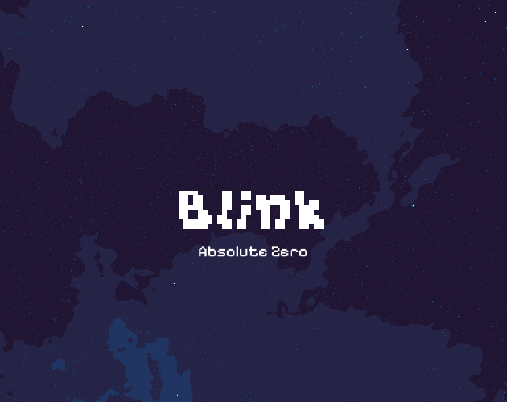
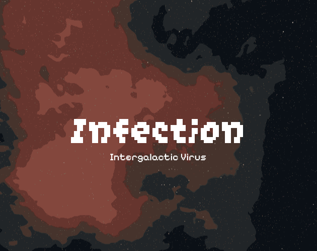





VoidPix is an asset pack based on generated procedural skyboxes in 1K resolution. It includes 22 unique procedurally generated skyboxes. No AI is involved, purely random sampling and generation technique.

You can find it on itch. 

[VoidPix Skybox Pack.](https://abhishta.itch.io/voidpix-skybox-pack)

