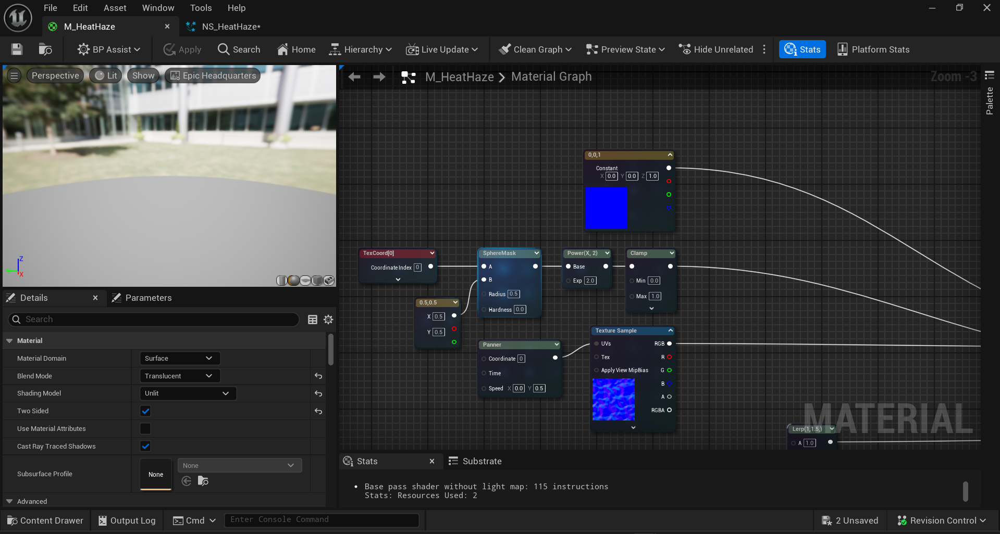
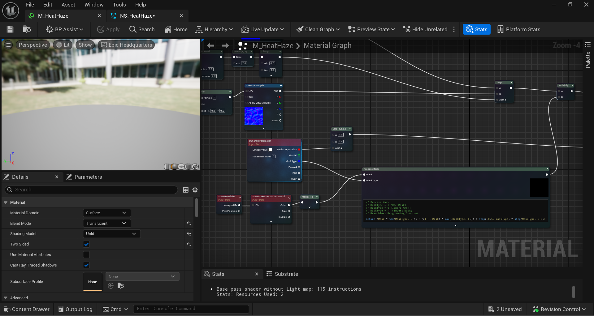
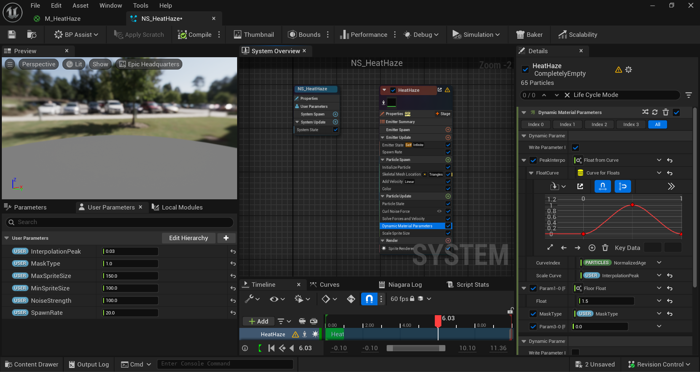

### Introduction

In my recent internship, one of the characters requires a special VFX around its body to enhance its visual elements. One of them was a distortion effect local to character as if the character was bending light. The distortion effect requires it to be local to the Skinned Mesh and easy to control by the Level Desginer. 

This article describes how I implemented a **custom niagara effect to distort space only within a masked area** in Unreal Engine 5.5 using Niagara Particle System.

### Development

#### Setting Up the Distortion Effect




The distortion effect was rather simple. We created a material with the refraction method set to `Index of Refraction`. An interpolation between a clear texture and a noise texture is applied to the **Normal** input, which drives how the background is distorted. A **SphereMask** is used to localize the distortion effect around the mesh, while a **Panner** animates the noise to create a shimmering, heat-like motion. To control the strength of the distortion, we added a **Dynamic Parameter** that adjusts the normal intensity in real time, giving level designers direct control over how strongly the mesh bends light.

#### Setting Up the Mask



For this material to only distort a certain defined area we defined a mask using a CustomStencil to only apply the effect within the mask. We simply use the SceneTexture node to get this value and check if it matches our defined mask. Values can range from [-1, 0, 1] where -1 applies only outside of the masked area, 0 applies the effect on everything, and 1 applies the effect on only the masked area. To define this easily, I used a custom node to check it fast.

```hlsl
// Process Mask
// MaskType = 1 (Use Mask)
// MaskType = 0 (Ignore MAsk)
// MaskType = -1 (Invert Mask)
// Branchless Programming Shortcut

return (Mask * max(MaskType, 0.)) + ((1. - Mask) * max(-MaskType, 0.)) + step(-0.5, MaskType) * step(MaskType, 0.5);
```

#### Spawning the Materials



Once our material is set up, we require Niagara to spawn these as particles around a Skinned Mesh and control its dynamic parameters as well. This gives more control towards Level Designer to tweak both the Material Parameters and the Niagara Parameters that is relevant to the effect.

#### Putting It All Together

Having this Niagara System, we can attach it to the Skeletal Mesh as it's parent. Within the Skeletal Mesh's rendering property, we also need to set it's Custom Depth Stencil Value. We set this to `1` as per our mask definition in the Material. We should see particles spawning that distort area around the mask defined by the MaskType parameter. 

### Limitations

Since Unreal uses Screen Space Refraction feature to compute refraction, there seems to be a minimum quality settings to enable this effect, The Minimum Quality Settings for this effect is ‘High’. The fallback will not exist any distortion, therefore its best to remove this effect when not meeting the quality requirement entirely.

### Conclusion

This system provides a simple, and controllable way to create distortion around a SKinned Mesh object (or any object you defined).

While it has limitations, this limitation is pretty normal since Screen Space Refraction is not suited for lower-end devices requiring lots of calculations.