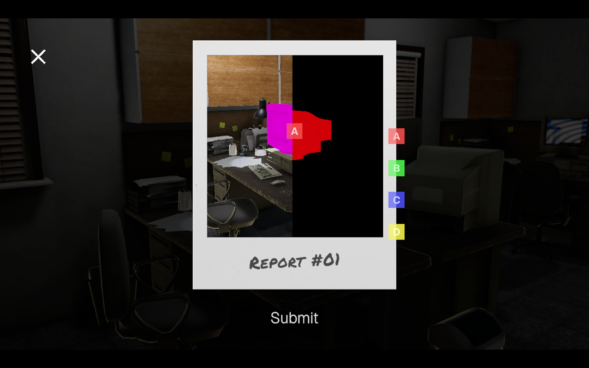

### Introduction

In my game *Quality Assurance*, I needed a system to **tag objects with colors** and later sample that information for gameplay mechanics. Crucially, this information needed to be **hidden from the player**, so it must be rendered off-screen.  

This article describes how I implemented a **custom color tag encoding pass** in Unity URP, using `ScriptableRendererFeature` and `MaterialPropertyBlock`.

### Development

#### Setting Up Per-Category Tags

To encode tags efficiently, I use `MaterialPropertyBlock` to assign a **color representing the object's category tag**:

```csharp
private void ApplyEncoding(Color tagColor)
{
    MaterialPropertyBlock block = new MaterialPropertyBlock();
    block.SetColor("_TagColor", tagColor);

    foreach (MeshRenderer renderer in meshRenderers)
    {
        if (renderer != null)
            renderer.SetPropertyBlock(block);
    }
}
```

Here, each object in a category shares the same tag color. This ensures objects in the same category are encoded consistently during the render pass.

#### Rendering Tags Off-Screen

To sample tags later, we need to render only the tag information to a render target. This requires:
1. A Custom Unlit Shader that outputs only the tag color.
2. A Render Feature that overrides the object's material with this tag material.

Here’s a simple shader for the tag material:

```hlsl
Shader "Unlit/TagColor"
{
    Properties
    {
        _TagColor ("Tag Color", Color) = (0,0,0,1)
    }
    SubShader
    {
        Tags { "RenderType"="Opaque" "Queue"="Geometry" }
        LOD 100

        Pass
        {
            Name "TagPass"
            tags { "LightMode"="SRPDefaultUnlit" }

            ZWrite On
            Cull Off
            Blend Off

            HLSLPROGRAM
            #pragma vertex vert
            #pragma fragment frag
            #include "Packages/com.unity.render-pipelines.universal/ShaderLibrary/Core.hlsl"

            CBUFFER_START(UnityPerMaterial)
            half4 _TagColor;
            CBUFFER_END

            struct Attributes
            {
                float4 positionOS : POSITION;
            };

            struct Varyings
            {
                float4 positionHCS : SV_POSITION;
            };

            Varyings vert(Attributes IN)
            {
                Varyings OUT;
                OUT.positionHCS = TransformObjectToHClip(IN.positionOS.xyz);
                return OUT;
            }

            half4 frag(Varyings IN) : SV_Target
            {
                return _TagColor;
            }
            ENDHLSL
        }
    }
}
```

#### The Render Feature

Next, we create a ScriptableRendererFeature that renders all tagged objects using the tag material:

```c#
public override void RecordRenderGraph(RenderGraph renderGraph, ContextContainer frameData)
{
    if (tagMaterials == null) return;

    var cameraData = frameData.Get<UniversalCameraData>();
    var resourceData = frameData.Get<UniversalResourceData>();
    var renderingData = frameData.Get<UniversalRenderingData>();

    var shaderTags = new[] { new ShaderTagId("UniversalForward"), new ShaderTagId("SRPDefaultUnlit") };

    var desc = new RendererListDesc(shaderTags, renderingData.cullResults, cameraData.camera)
    {
        rendererConfiguration = PerObjectData.None,
        renderQueueRange = RenderQueueRange.opaque,
        sortingCriteria = SortingCriteria.CommonOpaque,
        overrideMaterial = tagMaterials[ctType]
    };

    using (var builder = renderGraph.AddRasterRenderPass<PassData>("Color Tag Pass", out var passData))
    {
        passData.rendererList = renderGraph.CreateRendererList(desc);

        builder.UseRendererList(passData.rendererList);
        builder.SetRenderAttachment(resourceData.activeColorTexture, 0, AccessFlags.Write);

        builder.SetRenderFunc((PassData data, RasterGraphContext ctx) =>
        {
            ctx.cmd.DrawRendererList(data.rendererList);
        });
    }
}
```

Key points:
- Objects are rendered off-screen using the tag material.
- Each object writes its category or object tag as a color.

Later shaders or scripts can sample this render target for gameplay mechanics like selection, masking, or highlighting.


")
")


#### Using the Render Target

Once rendered, the tag buffer can be used:
- To determine object categories for gameplay logic.
- To create masks for post-processing effects.
- To handle dynamic interactions without exposing information to players.

For instance, you can render it just once per frame to a RenderTexture and immediately disable the pass to avoid showing it in-game.

#### Sampling the Render Target

Once the render target is captured, we can sample this texture to get it's tag. It is as simple as locating the pixel on the normal render and sampling it from the tags render target texture. We can use this code to sample it.

```c#
public void OnPointerClick(PointerEventData eventData)
    {
        // Convert to Local Space
        Vector2 localPoint;
        RectTransformUtility.ScreenPointToLocalPointInRectangle(
            rawImage.rectTransform,
            eventData.position,
            eventData.pressEventCamera,
            out localPoint
        );

        // Convert to UV
        Rect rect = rawImage.rectTransform.rect;
        float uvX = Mathf.InverseLerp(rect.xMin, rect.xMax, localPoint.x);
        float uvY = Mathf.InverseLerp(rect.yMin, rect.yMax, localPoint.y);

        // Convert to Pixel Coord
        int px = Mathf.FloorToInt(uvX * tagSnapshotTexture.width);
        int py = Mathf.FloorToInt(uvY * tagSnapshotTexture.height);
        
        // Read Texture
        Color tagColor = SampleTexture(tagSnapshotTexture, px, py);
        Color objectTagColor = SampleTexture(objectTagSnapshotTexture, px, py);

        // Visual Debug
        if (marker != null)
        {
            marker.SetParent(rawImage.rectTransform, false);
            
            // From UV to Local
            float lx = Mathf.Lerp(rect.xMin, rect.xMax, uvX);
            float ly = Mathf.Lerp(rect.yMin, rect.yMax, uvY);
            marker.localPosition = new Vector3(lx, ly, 0f);
        }

        Debug.Log($"Click UV=({uvX:F3},{uvY:F3})  Pixel=({px},{py})  TagColor={tagColor}  ObjectTagColor={objectTagColor}");
    }
```

### Limitations

Some caveats with this technique:

1. sRGB Color Noise
  - Colors like pure RED (1,0,0) may be interpreted differently in sRGB (0.8,0,0).
  - This limits the number of unique categories you can safely encode.
2. Category Limit (Caused by sRGB Color Noise)
  - With 7 colors (RED, BLUE, GREEN, YELLOW, MAGENTA, CYAN, WHITE), you can encode 7 categories.
  - You can combine colors for more categories, but this increases complexity and error risk.
3. Skybox Interference
  - Skyboxes may introduce unwanted pixels in the tag render.
  - Workarounds include using a custom opaque skybox or enclosing the level in a sphere.

### Conclusion

This system provides a simple, flexible way to encode per-object tags in Unity URP.

While it has limitations in color precision and category count, it’s easy to implement and allows off-screen metadata rendering for gameplay mechanics like selection, masking, and procedural effects.