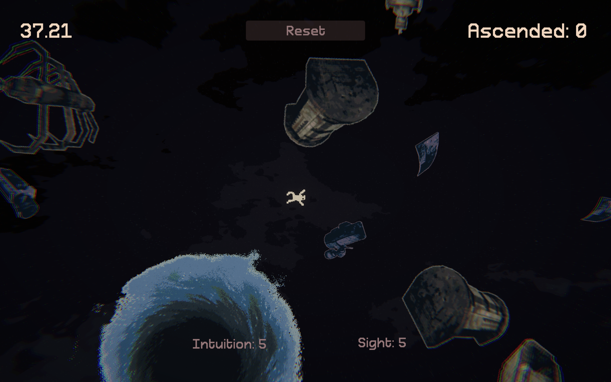
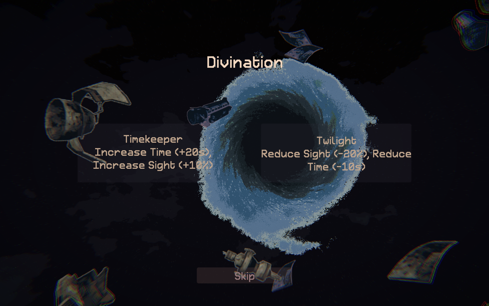

### Introduction  

**Micro Jam** is a competitive 48-hour game jam for developers of all levels, from beginners to veterans. Held bi-weekly, it features a prize pool of over $110, sponsored by Mini Script. For Jam 33, the theme was **“Void”**, with the prerequisite **“Death is not the end.”**  

After brainstorming a few concepts, I decided to interpret both literally: a game where death itself drives progress. My goal was to fully embrace the theme and win *Best Use of Theme*.

### Ideating  

Competing solo, I latched onto an idea: what if progress only came through death? Players would need to die repeatedly to achieve higher scores, but as the game advanced, dying would become increasingly difficult.  

Since the theme was “Void,” I set the stage in outer space. Players would take on the role of a spaceman drawn toward a **Spiraling Void**, each death pulling them into a higher dimension of existence. The core loop became clear: **reach the void, ascend, and chase a high score of ascension.**  

### Game Design  

With space as the backdrop, I fleshed out the narrative. The spaceman became a **Void-Traveling Entity**, ascending through dimensions to gain power.  

Orbiting the void were scattered pieces of space debris, acting as platforms to latch onto and launch from. Traversal required precision: misjudge a jump, and you’d drift into the emptiness of space.

To add depth, I designed power-ups with both buffs and debuffs. I enjoy creating upgrades where advantages come at a cost—too many buffs stack into a weakness. This duality forces players to strategize, ensuring every choice shapes their playstyle.  

### Prototyping  

I built the game in Unity for Web. Core mechanics started with a **flicking system**—similar to *Angry Birds*—to propel the entity from one point to another. 

")

For the debris, I sampled space-themed sprites and used my [Palette Conversion Tool](https://pypi.org/project/paleta/) to map them into a cohesive color scheme. Levels were designed around a central void, with debris scattered outward in a spiral, implicitly guiding players toward the goal. Each level spawned the player at a greater radius, increasing difficulty over time.  

Upon reaching the void, players chose between buffs and debuffs. Some improved time or vision, while others restricted direction or reduced clarity. This interplay created a dynamic system where players tailored their own approach.  

### Post Jam  

The game was well-received, especially for its creative use of the theme. Players found the gameplay challenging yet approachable, with a quirky premise that resonated with fellow developers.  

In the end, I was thrilled to win **first place overall** at Micro Jam 33. It was a rewarding experience surrounded by talented developers and inventive games.  

You can check out the game on Itch:  
[Devoid: Ascend to the Void](https://abhishta.itch.io/devoid-ascend-to-the-void)  