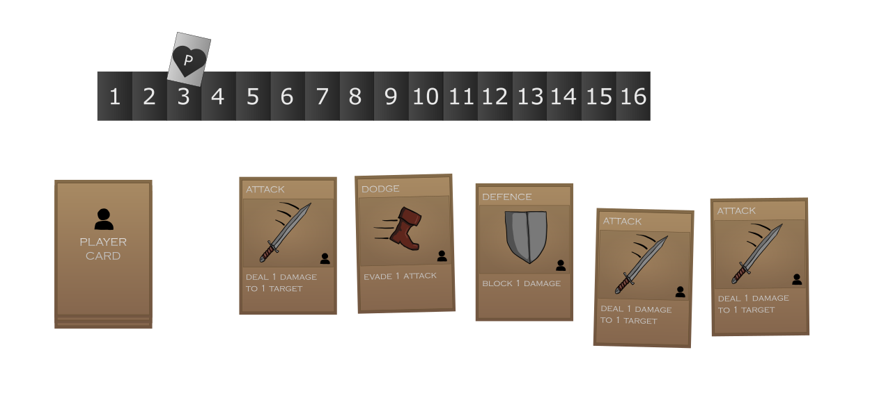
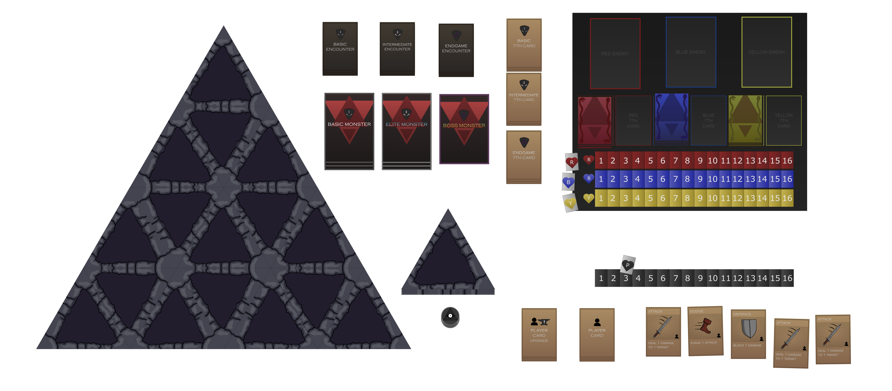

### Introduction  

With *Dungeon Run*, we set out to design a game that fills a unique space in the RPG genre: a short-form, **solo dungeon-crawling board game** with strategic depth and high replayability. While most RPG-inspired board games tend to be sprawling, multiplayer experiences that require hours to play, *Dungeon Run* was conceived as a **30–60 minute adventure**, built for players who love to explore, experiment, and overcome challenges on their own.  

Targeted at explorers and achievers, the game blends dungeon-crawling exploration with **card-based combat and deck-building mechanics**, offering a layered yet approachable experience.  

### High Concept  

The game takes place in the depths of the **Trigonal Abyss**, a mystical dungeon forged by the legendary wizard Pascala. At its core lies the **Tetra Head**, a reality-bending prism that leaks chaotic energy into the dungeon, reshaping its layout and spawning otherworldly monsters.  

The player, cast as a lone adventurer, must battle through enemies, collect loot, and strengthen their deck on the way to face the dungeon’s final guardian: the **Three-Headed Hydra**. Victory means claiming the Tetra Head—and the power to reshape reality itself.  

Our guiding design choice was simple: **explore the dungeon, defeat enemies, collect loot, upgrade your deck, and face the boss**.  

### Design Choices

#### Combat: Controlled Randomness  
We wanted combat to feel both strategic and unpredictable. The solution was our **7-card enemy system**:  

- Each enemy has six fixed action cards and one “wild” card drawn from a special deck.  
- This creates recognizable patterns while preserving enough randomness to keep battles fresh.  
- Encounters scale in difficulty across three phases, introducing tougher enemies and multi-enemy battles.  

The player fights using a **5-card hand**, playing two cards per turn before drawing new ones. Deck upgrades are limited in number, pushing players to make deliberate strategic choices.  

This system balances predictability (learning enemy patterns) with surprise (random action draws), giving combat a tactical, evolving feel.

#### Exploration: The Triangular Dungeon  
To mirror the chaos of Pascala’s dungeon, we designed an exploration system built around **triangular dungeon tiles**. These tiles are laid face-down, then gradually revealed as the player chooses their path. Each tile offers different functions:  

- **Battle tiles** trigger encounters.  
- **Forge tiles** allow deck upgrades.  
- **Healing tiles** restore health.  
- **Observation tiles** reveal adjacent tiles, giving a glimpse into the unknown.  

This mechanic creates a sense of discovery and strategy. Each playthrough offers a unique dungeon layout, with branching choices that affect the player’s path to the Hydra.  

#### Narrative: Lore in the Mechanics  
Rather than presenting story through text alone, we integrated narrative directly into the **rules, tiles, and encounters**. For example:  

- The ruleset introduces Pascala and the dungeon’s chaotic energy.  
- Dungeon tiles visually expand the world and hint at lore.  
- Enemies embody fragments of Pascala’s creations.  

By weaving narrative into mechanics, we created a quirky, mystical dungeon crawler where the lore naturally emerges from gameplay.  

### Why This Game?  

Most RPG board games are expansive, multiplayer, and time-consuming. We took inspiration from those systems but intentionally designed for:  

- **Accessibility** – shorter sessions and easier onboarding.  
- **Single-player focus** – tapping into a rarely explored niche in board games.  
- **Replayability** – randomized dungeons, diverse enemies, and modular card systems ensure no two runs feel the same.  

### Key Features We’re Proud Of  

- **Unique solo experience** – a board game fully designed for one player.  
- **Dynamic dungeon layout** – triangular tiles create fresh layouts and strategies each game.  
- **Semi-random enemy AI** – enemies with patterns you can learn, but never fully predict.  
- **Card-driven mechanics** – all actions, both player and enemy, are governed by cards for tactical consistency.  
- **Strategic progression** – players balance buffs, debuffs, and deck upgrades across three escalating phases.  
- **High replayability** – modular systems ensure every run feels different.  

### Conclusion  

*Dungeon Run* is our answer to the demand for immersive, strategy-driven RPGs that don’t require hours to play or multiple players to enjoy. By combining **deck-building combat, tile-based exploration, and a narrative woven into mechanics**, we’ve built a quirky, mystical dungeon crawler that rewards both strategic planning and curiosity.  

It’s short, it’s sharp, and it’s designed to challenge solo adventurers who dare to descend into the **Trigonal Abyss**.  