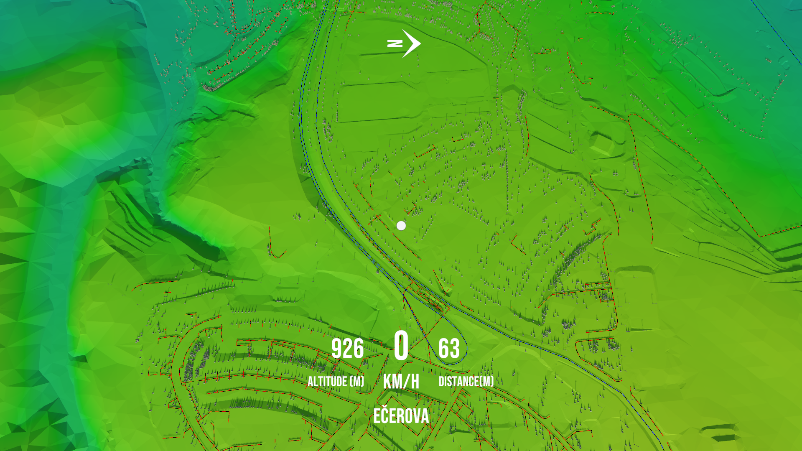
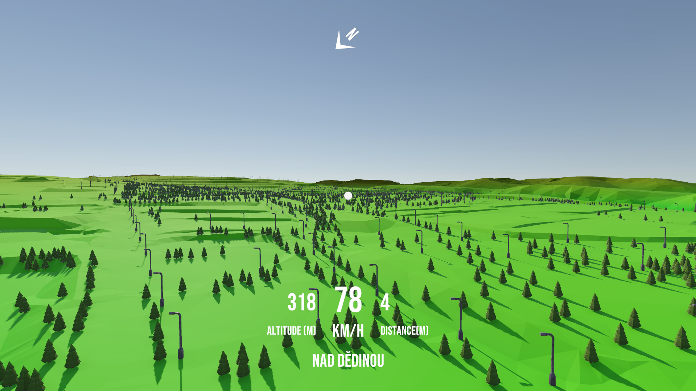
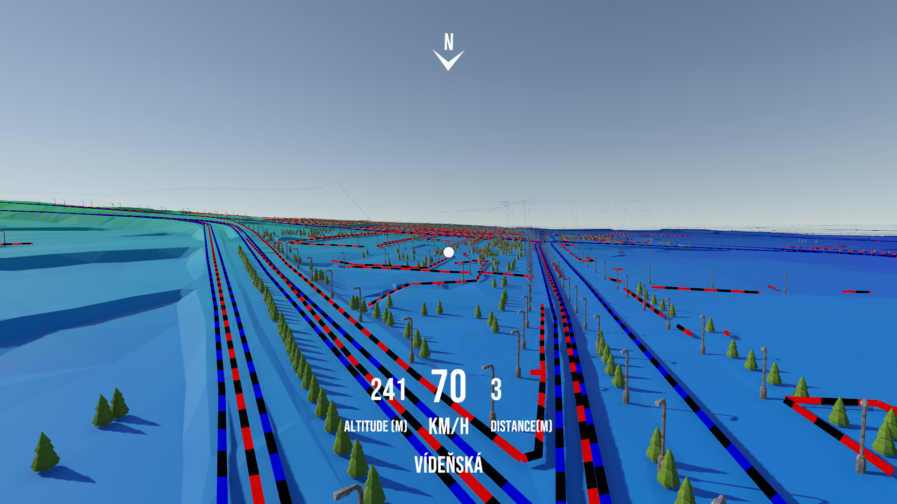





### Introduction

During my time at **HCILab**, under the supervision of **Jonas Rosecký**, I developed **GISMU**, a Unity-based system for visualizing geospatial data in 3D. The project focused on Brno, CZ, exploring how terrain, transport, and infrastructure data could be transformed into an interactive environment — with future potential for VR exploration.  

### What We Built  

GISMU reconstructs Brno’s terrain from the **2019 Digital Terrain Model** and layers it with multiple datasets from [data.brno.cz](https://data.brno.cz/), including:  

- Public transport lines (bus routes)  
- Sidewalk networks  
- Trees   
- Streetlights  

The tool parses shapefiles directly (Polygon, LineString, and Point geometries) using **NetTopologySuite**, enabling a modular pipeline for extending to new datasets.  

### Challenges & Design Decisions  

Working with **millions of spatial objects** in Unity was a significant challenge. To make the system performant, I implemented several optimizations:  

#### 1. Efficient Rendering with Mesh Instancing  
Rendering thousands of trees, lights, and other points individually quickly overwhelmed Unity. To solve this, I used **GPU mesh instancing**, batching objects into groups of 1000. This reduced draw calls drastically and kept framerates stable.  

#### 2. Raycasting for Terrain Alignment  
All objects from sidewalk lines, tree points, and streetlight points had to “sit” on top of the terrain mesh. Instead of guessing heights from raw data, I used **raycasting** against the reconstructed terrain so each object was properly aligned, even with elevation changes.

The raycasting is done during runtime sequentially in batched to reduce performance overhead during setup calculation.

#### 3. Shapefile Parsing with NetTopologySuite  
Using **NetTopologySuite with Esri shapefile support**, I was able to directly read geospatial geometries and convert them into Unity meshes. This required building a robust coordinate transformation system (SJTSK → WGS84 → Unity world coordinates) with **ProjNet**.  

#### 4. Terrain Chunking for Performance  
The terrain of Brno covers a large area. To avoid hitting Unity’s **65k vertex per mesh** limit and to improve culling, I split the terrain into **uniform centroid grid chunks**. Each chunk could then be managed independently, improving both memory use and runtime efficiency.  

### Why It Matters  

GISMU shows how **game engines like Unity** can be applied beyond games, giving geospatial data an interactive and immersive dimension. With potential VR integration, GISMU opens possibilities for:  

- Urban planning & infrastructure visualization  
- Educational tools for geography and city studies  
- General-purpose geospatial exploration  

### Conclusion  

This project combined **computer graphics techniques, GIS processing, and Unity optimizations** into a cohesive pipeline. The end result: a tool that turns raw shapefiles into an explorable 3D city landscape — bridging geospatial science and immersive visualization.

You can find the presentation and project below. 

[GISMU Presentation](https://docs.google.com/presentation/d/1Ty8MROYpmoyvW1nSxLcMv1dthsjgEUGgyW7t9UHhUJ0/edit?usp=sharing)

[GISMU](https://github.com/abhishtagatya/GISMU)