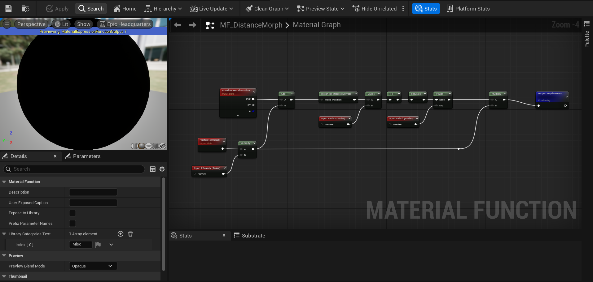
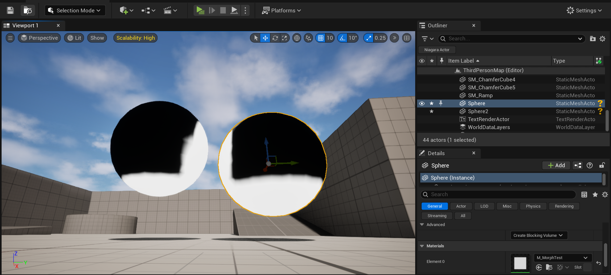
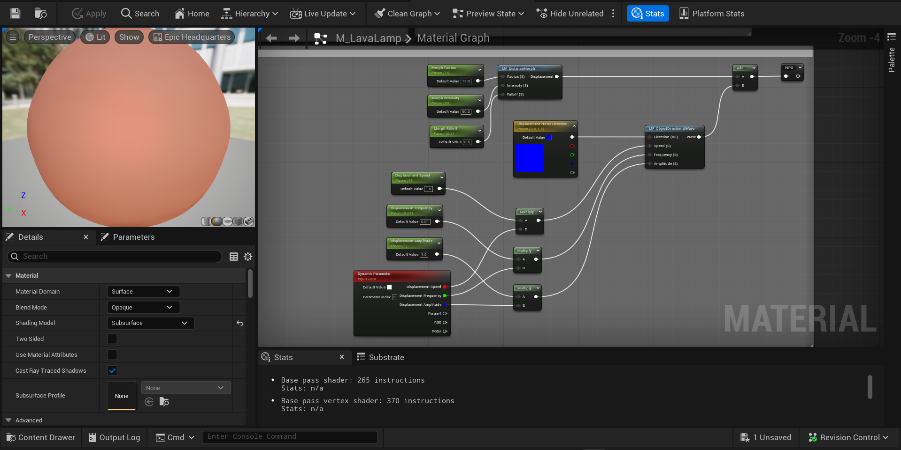
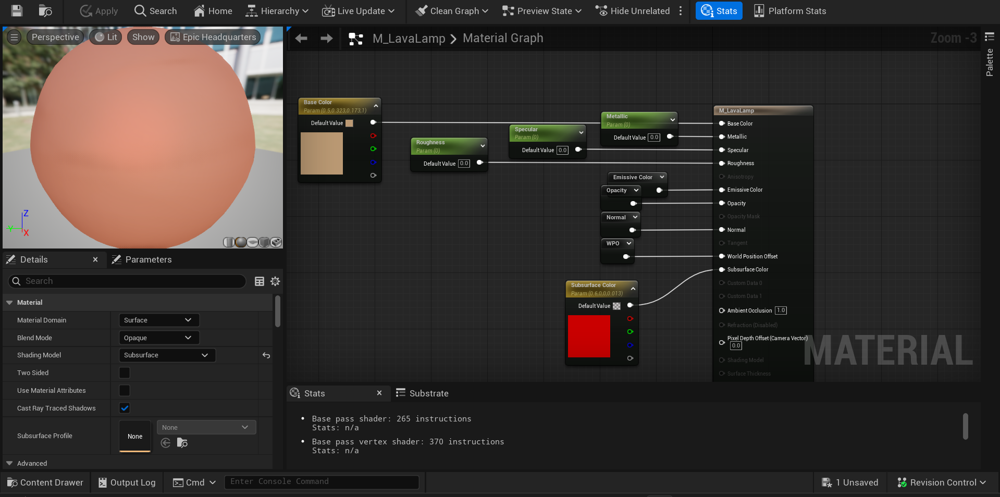



### TL;DR

Making a Metaball VFX in Unreal Engine 5 using Distance Field Deformation and Subsurface Material.

[ArtStation](https://www.artstation.com/artwork/qJVmzz)

---

### Introduction

Experimenting to create a Metaball-like Effect that is performant using Unreal Engine's Distance Field. Distance Fields allow us to get information regarding the object's proximity with another object that also has a Distance Field. Using this, we can calculate the deformation to create a smooth transition between the Metaball-Like Object and the Environment to create a smooth-blend from simple deformation towards the direction of the closest distance field surface.

---

### Development

#### Distance Deformation Function

To calculate the distance between the object and and the nearest surface, we can use the `distanceToNearestSurface` and get access of this information (granted you have Distance Fields enabled on your Project Settings).

With this, we can calculate the distance to the nearest surface of every vertices and also calculate the direction in World Space for the vertices to deform to. We use this and multiply it with the direction of our normal to be our World Position Offset (WPO) value. Here's a preview of this calculation (in unit length).

[Deformation Material Function](https://blueprintue.com/blueprint/fb-coei1/)

#### Directional Displacement

To make the metaballs feel less rigid, I decided to add some displacements that suited the motion. Within my experiment, I simply just use a axis displacement (displacing the vertices along the axis) to make it look like the blobs are swimming upwards. Of course, this can be used in tandem with any displacement you want, some might make or break the main Disnace Deformation effect.

#### Shading

For the shading, you can practically create anything you desire (with some Limitations mentioned below). For my experiment, I wanted to creat that Lava Lamp look, so I used a Subsurface Material to blend Subsurface Scattering on light emission, making the object seems to glow and lava lamp like. To achieve this, I simply use the Fresnel to interpolate between Base and Subsurface Color.

### Limitations

Because we are using Distance Fields that were originally designed for Distance Field Ambient Occlusion (DFAO), this approach repurposes the technique beyond its intended use. One major limitation is that translucent materials do not support distance fields, meaning this method cannot be used when blending with translucent surfaces. However, if a workaround is implemented using masked materials with temporal dithering, this approach can still be viable. In short, if an object does not have Distance Fields, this effect is unusable.

Another issue is the difficulty of achieving smooth deformations on rapidly moving objects. Since DFAO was not designed for continuous, high-speed real-time updates, this can lead to deformation artifacts that degrade the visual quality of the effect.

### Conclusion  

Creating Metaballs using Distance Fields are computationally cheap compared to finer approaches like Ray Marching. It's flexible for many cases despite it's limitations.