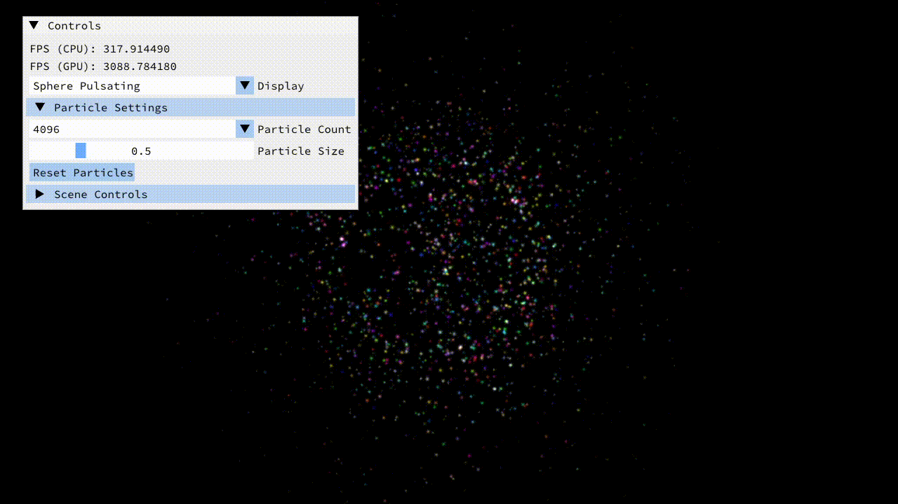

### Introduction 

This project is a **GPU-accelerated particle simulation** built with OpenGL. Motion is calculated using **vertex and compute shaders**, where each particle follows defined rules of interaction and evolution.  

The playground allows experimenting with different particle behaviors, from simple spawning to complex N-body simulations and mesh surface interactions.  

### Features  

1. **Spawning Particle Program**  
   Particles spawn with random lifetime, velocity, and color within a defined area.  

     

2. **Single Attractor**  
   Particles are drawn toward a movable attractor point on the screen.  

     

3. **Multi Attractor**  
   Particles respond to multiple attractor points, each influencing their trajectory.  

     

4. **N-Body Simulation**  
   Particles interact with one another using an inverse-square law, simulating gravitational-like forces.  

     

5. **Mesh Surface Estimation**  
   Particles are guided toward random points on a mesh surface, creating a surface-filling effect.  

     

### Conclusion  

The **Particle Simulation Playground** highlights the versatility of GPU programming with OpenGL. By leveraging shaders for motion, interaction, and rendering, it creates visually rich simulations that can scale efficiently while offering diverse particle behaviors.  
