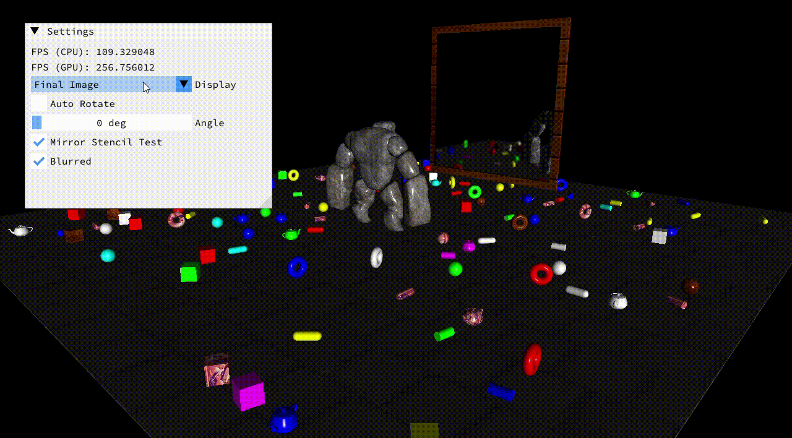

### Introduction

This project demonstrates how to create a **mirror effect in OpenGL** using stencil buffers, framebuffers, and object masking. The result is a composed scene where the mirror view is rendered realistically, with optional blur outside masked objects.  

### Approach  

The mirror was built using a multi-pass rendering pipeline:  

1. **Mirror Camera Transformation**  
   The mirror camera is derived from the main camera by reflecting its view matrix across the mirror plane.  

   $$
   V_{mirror} = V \cdot M \cdot R_z \cdot M^{-1}
   $$  
 
   - $V$ = Main camera view matrix  
   - $M$ = Mirror transform  
   - $R_z$ = Reflection matrix across the z-axis  

2. **Framebuffer Setup**  
   - **Real FBO**: Renders the normal world view.  
  
   - **Mirror FBO**: Renders the mirrored scene for use inside the mirror.  
  
   - **Mask FBO**: Defines regions where blur should not be applied.  

3. **Scene Composition**  
   A shader composites the textures into a final full-screen quad:  
   - Mirror content is blurred with Gaussian blur.  
   - Objects within the mask remain sharp.

### Performance  

Tested on: **Intel Core i5-1335U, Intel Iris Xe Graphics, 16GB RAM**  

| Scene           | FPS (CPU–GPU) |
|-----------------|---------------|
| Composed Scene  | 90–250        |  

### Conclusion  

This project shows how **reflection matrices, FBOs, and masking** can work together in OpenGL to create a performant, realistic mirror system. The method is modular and can be extended to portals, water reflections, or multi-layered effects.  

You can find the project below.

[MirrorScene](https://github.com/abhishtagatya/mirror_scene)
