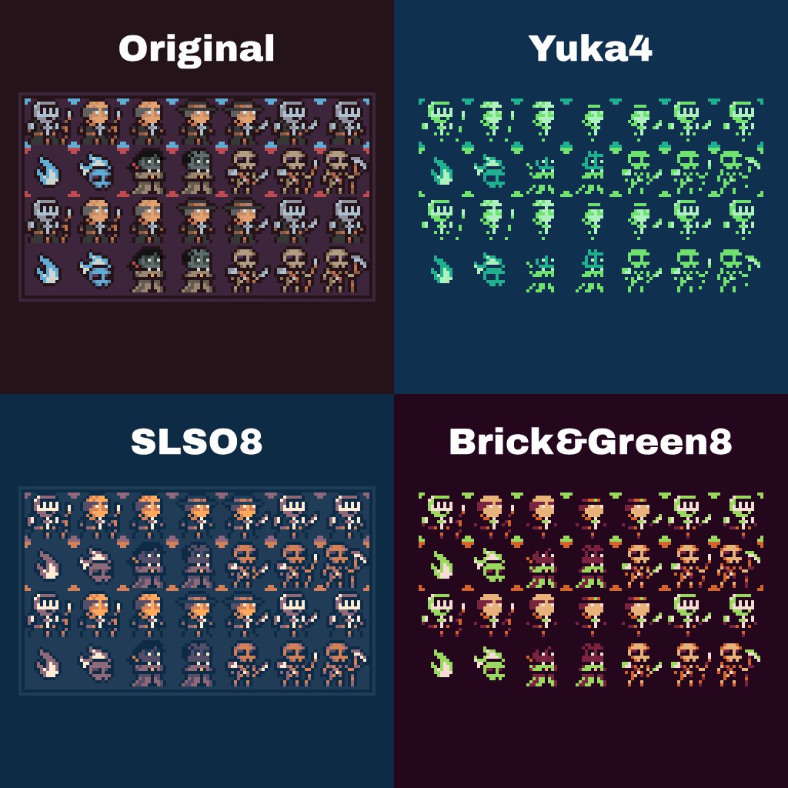

Paleta is a powerful Color Palette Extraction and Management Tool designed to enhance visual game assets. It allows designers & developers to extract, convert, mix, minimize, and match color palettes effortlessly. 

Colors are treated as vectors (RGBA), while palettes are sets of colors supporting union, intersection, addition, and removal. Paleta integrates with Lospec for importing palettes and provides functions for mapping between palettes using distance metrics or custom algorithms. Users can also export palettes or map them onto images. 

With tools to minimize, maximize, and randomize palettes, Paleta simplifies visual asset creation and ensures consistent, vibrant color management for any project.

You can find it on Pip. 

[Python Package](https://pypi.org/project/paleta/#description)